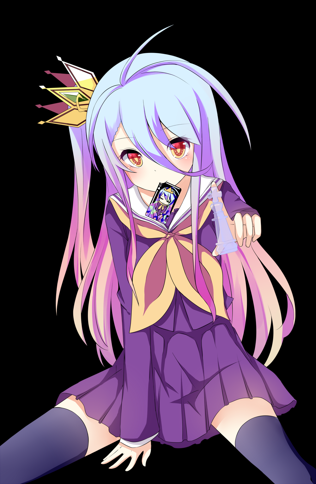

<!-- Banner -->

    

<!-- Title -->

<h1 align="center">Allu, I'm <a href="https://github.com/ShiroKitsuneLP">Shiro</a>! ❄️</h1>

<h2 align="center"> Welcome to my GitHub profile~ UwU</h2>

<!-- About Me -->

<h2 align="center">About Me</h2>

    Hi! My name is Shiro and I'm from Germany.    
    I'm passionate about anime, coding, gaming, and drawing.

    

<!-- Interests -->

<h2 align="center">Interests</h2>

    I'm interested in a variety of topics, including:

    Anime and Manga  
    Video Games  
    Programming  
    Drawing and Art

<!-- Skills -->

<h2 align="center">Skills</h2>

    
    
    
    
    

<!-- Active Projects -->

<h2 align="center">Active Projects</h2>

    Here are some of my active projects:

    
    

<!-- Stats -->

<h2 align="center">GitHub Stats</h2>

    

<!-- Discord -->

<h2 align="center">Discord</h2>

    You can find me on Discord

    

<!-- Footer -->
<h2 align="center">Thanks for visiting my profile!</h2>

    

    Made with ❤️ by <a href="https://github.com/ShiroKitsuneLP">Shiro</a>

